# Frontend Repository Structure - scan_mitra

This diagram reflects the current frontend workspace layout.

Scope notes:
- Included: source code, route groups, reusable components, assets, and key config files.
- Excluded for readability: `node_modules/`, `.next/`, and other generated output folders.

## Visual Diagram (Mermaid)

```mermaid
flowchart TD
    ROOT["scan_mitra/"]

    ROOT --> CFG["Config and meta files"]
    CFG --> CFG1["package.json"]
    CFG --> CFG2["tsconfig.json"]
    CFG --> CFG3["next.config.ts"]
    CFG --> CFG4["eslint.config.mjs"]
    CFG --> CFG5["postcss.config.js"]
    CFG --> CFG6["prettier.config.js"]
    CFG --> CFG7["README.md"]

    ROOT --> DOCS["docs/"]
    DOCS --> DOC1["doc.md"]
    DOCS --> DOC2["scanmitra-architecture (1).html"]
    DOCS --> DOC3["scanmitra.excalidraw"]
    DOCS --> DOC4["ScanMitra BMC ppt.pptx"]

    ROOT --> PUBLIC["public/"]
    PUBLIC --> IMG["images/"]
    IMG --> I1["brand/"]
    IMG --> I2["cards/"]
    IMG --> I3["carousel/"]
    IMG --> I4["chat/"]
    IMG --> I5["country/"]
    IMG --> I6["error/"]
    IMG --> I7["grid-image/"]
    IMG --> I8["icons/"]
    IMG --> I9["logo/"]
    IMG --> I10["product/"]
    IMG --> I11["shape/"]
    IMG --> I12["task/"]
    IMG --> I13["user/"]
    IMG --> I14["video-thumb/"]

    ROOT --> SRC["src/"]

    SRC --> APP["app/"]
    APP --> APP1["layout.tsx"]
    APP --> APP2["globals.css"]
    APP --> APP3["not-found.tsx"]
    APP --> APP4["favicon.ico"]

    APP --> ADMIN["(admin)/"]
    ADMIN --> ADMIN1["layout.tsx"]
    ADMIN --> ADMIN2["page.tsx"]
    ADMIN --> OTHERS["(others-pages)/"]
    OTHERS --> O1["(chart)/"]
    OTHERS --> O2["(forms)/"]
    OTHERS --> O3["(tables)/"]
    OTHERS --> O4["blank/"]
    OTHERS --> O5["calendar/"]
    OTHERS --> O6["profile/"]
    ADMIN --> UIE["(ui-elements)/"]
    UIE --> U1["alerts/"]
    UIE --> U2["avatars/"]
    UIE --> U3["badge/"]
    UIE --> U4["buttons/"]
    UIE --> U5["images/"]
    UIE --> U6["modals/"]
    UIE --> U7["videos/"]

    APP --> FWP["(full-width-pages)/"]
    FWP --> F1["layout.tsx"]
    FWP --> AUTH["(auth)/"]
    AUTH --> A1["layout.tsx"]
    AUTH --> A2["signin/"]
    AUTH --> A3["signup/"]
    FWP --> ERR["(error-pages)/"]
    ERR --> E1["error-404/"]

    SRC --> CMP["components/"]
    CMP --> C1["auth/"]
    CMP --> C2["calendar/"]
    CMP --> C3["charts/"]
    C3 --> C3A["bar/"]
    C3 --> C3B["line/"]
    CMP --> C4["common/"]
    CMP --> C5["ecommerce/"]
    CMP --> C6["example/"]
    C6 --> C6A["ModalExample/"]
    CMP --> C7["form/"]
    C7 --> C7A["form-elements/"]
    C7 --> C7B["group-input/"]
    C7 --> C7C["input/"]
    C7 --> C7D["switch/"]
    CMP --> C8["header/"]
    CMP --> C9["tables/"]
    CMP --> C10["ui/"]
    C10 --> C10A["alert/"]
    C10 --> C10B["avatar/"]
    C10 --> C10C["badge/"]
    C10 --> C10D["button/"]
    C10 --> C10E["dropdown/"]
    C10 --> C10F["images/"]
    C10 --> C10G["modal/"]
    C10 --> C10H["table/"]
    C10 --> C10I["video/"]
    CMP --> C11["user-profile/"]
    CMP --> C12["videos/"]

    SRC --> CTX["context/"]
    CTX --> CTX1["SidebarContext.tsx"]
    CTX --> CTX2["ThemeContext.tsx"]

    SRC --> HOOKS["hooks/"]
    HOOKS --> H1["useGoBack.ts"]
    HOOKS --> H2["useModal.ts"]

    SRC --> ICONS["icons/"]
    ICONS --> ICONS1["index.tsx"]

    SRC --> LAYOUT["layout/"]
    LAYOUT --> L1["AppHeader.tsx"]
    LAYOUT --> L2["AppSidebar.tsx"]
    LAYOUT --> L3["Backdrop.tsx"]
    LAYOUT --> L4["SidebarWidget.tsx"]

    SRC --> SVGDTS["svg.d.ts"]
```



## Text Tree (Quick Scan)

```text
scan_mitra/
|- docs/
|  |- doc.md
|  |- scanmitra-architecture (1).html
|  |- scanmitra.excalidraw
|  `- ScanMitra BMC ppt.pptx
|- public/
|  `- images/
|     |- brand/ cards/ carousel/ chat/ country/ error/ grid-image/
|     `- icons/ logo/ product/ shape/ task/ user/ video-thumb/
|- src/
|  |- app/
|  |  |- (admin)/
|  |  |  |- layout.tsx
|  |  |  |- page.tsx
|  |  |  |- (others-pages)/
|  |  |  |  |- (chart)/ (forms)/ (tables)/ blank/ calendar/ profile/
|  |  |  `- (ui-elements)/
|  |  |     `- alerts/ avatars/ badge/ buttons/ images/ modals/ videos/
|  |  `- (full-width-pages)/
|  |     |- layout.tsx
|  |     |- (auth)/ layout.tsx, signin/, signup/
|  |     `- (error-pages)/ error-404/
|  |- components/
|  |  |- auth/ calendar/ common/ ecommerce/ header/ tables/
|  |  |- charts/ (bar/, line/)
|  |  |- example/ (ModalExample/)
|  |  |- form/ (form-elements/, group-input/, input/, switch/)
|  |  |- ui/ (alert/, avatar/, badge/, button/, dropdown/, images/, modal/, table/, video/)
|  |  `- user-profile/ videos/
|  |- context/ (SidebarContext.tsx, ThemeContext.tsx)
|  |- hooks/ (useGoBack.ts, useModal.ts)
|  |- icons/ (index.tsx)
|  |- layout/ (AppHeader.tsx, AppSidebar.tsx, Backdrop.tsx, SidebarWidget.tsx)
|  `- svg.d.ts
|- package.json
|- tsconfig.json
|- next.config.ts
|- eslint.config.mjs
|- postcss.config.js
|- prettier.config.js
`- README.md
```
